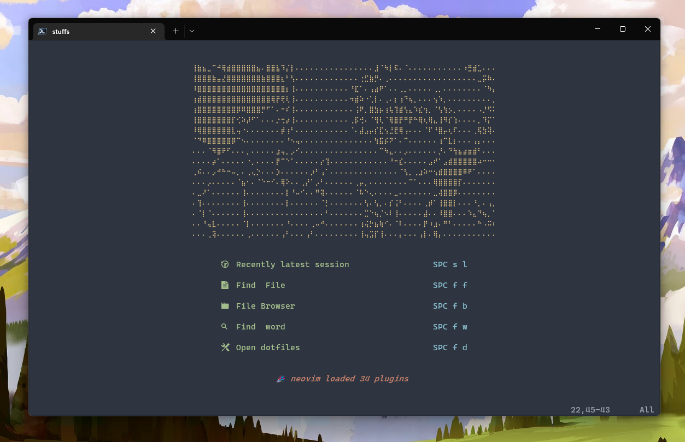
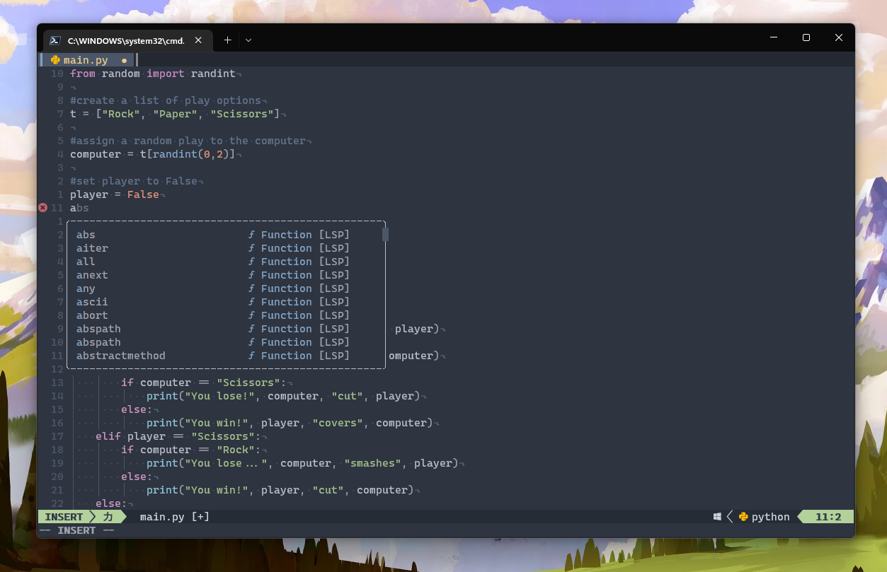

# Neovim with Lua

## QuickStart
--------------------

Steps to try out this config

<b>1. Install the dependencies</b>

  
- [Neovim](https://github.com/neovim/neovim/releases/tag/v0.7.2) v0.7.2
- Some [Nerd Font](https://www.nerdfonts.com/)

> Note: I tried to use LSP on neovim nightly (installed through chocolatey) without success.

 

<b>2. Clone the repo</b>

    git clone https://github.com/scarktt/nvim.git "$env:LOCALAPPDATA\nvim"

> ️ℹ️ You have to remove your current config located in ~\AppData\Local\nvim
  
 

<b>3. Run neovim and wait until the plugin installation ends</b>

> ℹ️ For a cleanner plugins installation you can remove all the files located in ~\AppData\Local\nvim-data
  
 

**4. You're done!**

## Config Layout
--------------------

    │   init.lua
    │
    └───lua
       │   keymaps.lua
       │   options.lua
       │   plugins.lua
       │
       └───user
           │   autopairs.lua
           │   barbar.lua
           │   cmp.lua
           │   colorizer.lua
           │   commenter.lua
           │   dashboard.lua
           │   gitsigns.lua
           │   indent-blankline.lua
           │   lspkind_icons.lua
           │   lualine.lua
           │   notify.lua
           │   telescope.lua
           │   tree.lua
           │   treesitter.lua
           │
           ├───colorschemes
           │       init.lua
           │       nightfox.lua
           │       tokyonight.lua
           │
           └───lsp
                   handlers.lua
                   init.lua
                   mason-lspconfig.lua

## Plugins list
--------------------

-  Insert parents, quotes and brackets in pair with [nvim-autopairs](https://github.com/windwp/nvim-autopairs)
-  Re-orderable, auto-sizing, clickable tabs, icons and more with [Barbar](https://github.com/romgrk/barbar.nvim)
-  Code completion with [cmp](https://github.com/hrsh7th/nvim-cmp)
-  Color highlighter with [colorizer.lua](https://github.com/norcalli/nvim-colorizer.lua)
-  Code comenter with [nvim-comment](https://github.com/terrortylor/nvim-comment)
-  Startup [Dashboard](https://github.com/glepnir/dashboard-nvim)
-  Git decorations with [gitsigns](https://github.com/lewis6991/gitsigns.nvim)
-  Indentation guides with [indent-blankline](https://github.com/lukas-reineke/indent-blankline.nvim)
-  Neovim statusline with [lualine](https://github.com/nvim-lualine/lualine.nvim)
-  Pretty notifications with [notify](https://github.com/rcarriga/nvim-notify)
-  File fuzzy finder with [telescope](https://github.com/nvim-telescope/telescope.nvim)
-  File explorer within nvim with [nvim-tree](https://github.com/kyazdani42/nvim-tree.lua)
-  Language highlighting with [nvim-treesitter](https://github.com/nvim-treesitter/nvim-treesitter)
-  LSP config with [nvim-lspconfig](https://github.com/neovim/nvim-lspconfig)
-  Language servers installer with [mason](https://github.com/williamboman/mason.nvim)

