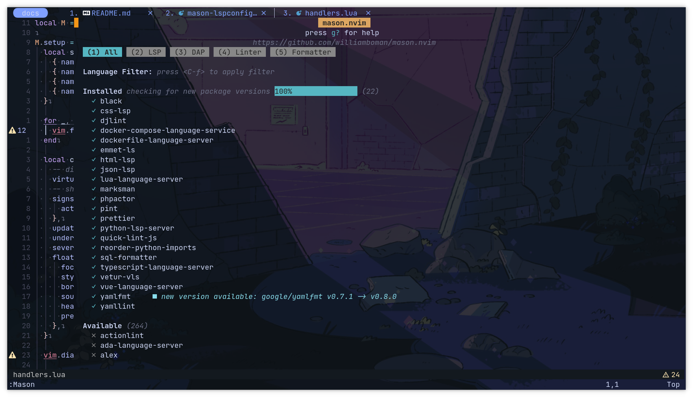
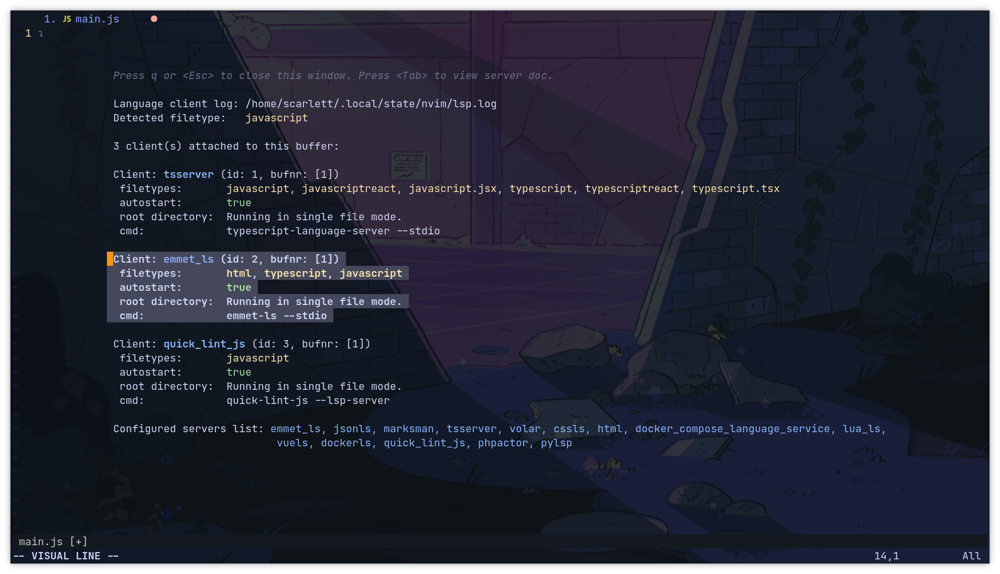

# Neovim with Lua


## QuickStart
--------------------

Steps to try out this config

<details close>

<summary><b>1. Install the dependencies</b></summary>
  
- Windows specific
  - [C/C++ Compiler](https://github.com/nvim-treesitter/nvim-treesitter/wiki/Windows-support)

- [Neovim stable version](https://github.com/neovim/neovim/releases/tag/stable)
- Some [Nerd Font](https://www.nerdfonts.com/)


<br>

</details>

<details close>

<summary><b>2. Clone the repo</b></summary>

To find out where the neovim config files are located, you need to go into neovim and type:

    :echo stdpath('config')

- Windows

```bash
git clone git@github.com:scarktt/nvim.git "$env:LOCALAPPDATA\nvim"
```
    > ️ℹ️ You have to remove your current plugins located in ~\AppData\Local\nvim

- Linux (Tested on Manjaro and MacOS)

```bash
git clone git@github.com:scarktt/nvim.git ~/.config/nvim/
```

<br>

</details>

<details close>

<summary><b>3. Run neovim and wait until the plugin installation ends</b></summary>

Before start neovim it is necessary to remove any previous package.

- Windows

> ℹ️ For a cleanner plugins installation you can remove all the files located in ~\AppData\Local\nvim-data

- Linux

> ️ℹ️ You have to remove your current plugins located in ~/.local/share/nvim/
  
<br>

</details>

**4. You're done!**

## Config Layout
--------------------

    │   init.lua
    │
    └─── 📂 lua
       │   keymaps.lua
       │   options.lua
       │   plugins.lua
       │
       └──- 📂 user
           │   autopairs.lua
           │   barbar.lua
           │   cmp.lua
           │   colorizer.lua
           │   commenter.lua
           │   dashboard.lua
           │   gitsigns.lua
           │   indent-blankline.lua
           │   lspkind_icons.lua
           │   lualine.lua
           │   markdown.lua
           │   notify.lua
           │   telescope.lua
           │   tree.lua
           │   treesitter.lua
           │
           ├─── 📂 colorschemes
           │       init.lua
           │       nightfox.lua
           │       everforest.lua
           │       gruvbox-material.lua
           │       tokyonight.lua
           │
           └─── 📂 lsp
                   handlers.lua
                   init.lua
                   mason-lspconfig.lua

## Plugins list
--------------------

-  Insert parents, quotes and brackets in pair with [nvim-autopairs](https://github.com/windwp/nvim-autopairs)
-  Re-orderable, auto-sizing, clickable tabs, icons and more with [Barbar](https://github.com/romgrk/barbar.nvim)
-  Code completion with [cmp](https://github.com/hrsh7th/nvim-cmp)
-  Color highlighter with [colorizer.lua](https://github.com/norcalli/nvim-colorizer.lua)
-  Code comenter with [nvim-comment](https://github.com/terrortylor/nvim-comment)
-  Startup [Dashboard](https://github.com/glepnir/dashboard-nvim)
-  Git decorations with [gitsigns](https://github.com/lewis6991/gitsigns.nvim)
-  Indentation guides with [indent-blankline](https://github.com/lukas-reineke/indent-blankline.nvim)
-  Neovim statusline with [lualine](https://github.com/nvim-lualine/lualine.nvim)
-  Pretty notifications with [notify](https://github.com/rcarriga/nvim-notify)
-  File fuzzy finder with [telescope](https://github.com/nvim-telescope/telescope.nvim)
-  File explorer within nvim with [nvim-tree](https://github.com/kyazdani42/nvim-tree.lua)
-  Language highlighting with [nvim-treesitter](https://github.com/nvim-treesitter/nvim-treesitter)
-  LSP config with [nvim-lspconfig](https://github.com/neovim/nvim-lspconfig)
-  Language servers, linters, and formatters installer with [mason](https://github.com/williamboman/mason.nvim)
-  To use lspconfig more easily with mason use the extension [mason-lspconfig](https://github.com/williamboman/mason-lspconfig.nvim)
-  Markdown preview on browser with [markdown-preview](https://github.com/iamcco/markdown-preview.nvim)

## LSP Servers, Linters and Formaters Setup
--------------------

### Installation

To install a language server like python-lsp-server you have to start Mason plugin and install it from there:

    :Mason



### Server Customization

You can update the server-specific configuration during the configuration of the mason-lspconfig handlers:

> `handlers` is a table where the keys are the name of an lspconfig server, and the values are the function to be called when that server is ready to be set up.

`/lua/plugins-config/lsp/mason-lspconfig.lua`

In this example, the default Emmet server configuration is being overridden so that Emmet is added to buffers that hold typescript and javascript files:

```lua
mason_lspconfig.setup_handlers {

  function (server_name)
    -- We are overriding the default Emmet server setup handler
    -- to have access to all html tags inside .ts and .js files
    if server_name == "emmet_ls" then
      lsp_config["emmet_ls"].setup {
        filetypes = {'html', 'typescript', 'javascript'},
        root_dir = lsp_config.util.find_git_ancestor,
        on_attach = require("plugins-config.lsp.handlers").on_attach,
        capabilities = require("plugins-config.lsp.handlers").capabilities,
      }
    else
      lsp_config[server_name].setup {
        on_attach = require("plugins-config.lsp.handlers").on_attach,
        capabilities = require("plugins-config.lsp.handlers").capabilities,
      }
    end

  end

}
```



> Note: It is necessary to use the `lspconfig` server names, not `mason's` package names. You can see the name mapping list [here](https://github.com/williamboman/mason-lspconfig.nvim/blob/main/doc/server-mapping.md).
